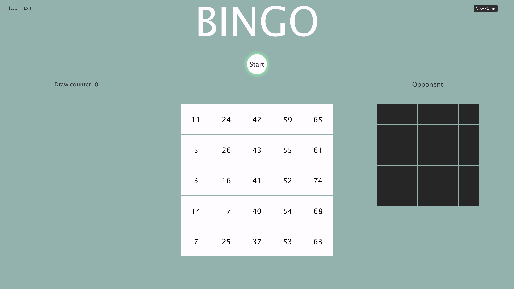

# Bingo-Spiel (PiS, SoSe 2021)

Autor: Julian Scheffler, 5164983

## Kurzbeschreibung 

Mein Programm ist die Umsetzung der klassischen 75-Kugel Variante des Spiels "Bingo". Dabei spielt der Spieler gegen den Computer.
Der Spieler und der Computer erhalten jeweils eine Bingo-Karte.
Der Spieler zieht die Kugeln selbst, um die Spiel-Geschwindigkeit bestimmen zu können.
Auch die Felder markiert der Spieler selbst.
Der Computer markiert seine Felder, nachdem eine Kugel gezogen wurde, automatisch.
Dabei wird der Aufruf der Funktion verzögert, um das Spielgeschehen etwas realistischer zu gestalten.
Felder können erst dann markiert werden, wenn die Zahl auf dem Feld bereits gezogen wurde.
Es gewinnt derjenige, der zuerst fünf Felder vertikal, horizontal oder diagonal in einer Reihe markiert hat. 
Nachdem es einen Sieger gibt, kann man keine Felder mehr markieren oder weiterhin Bälle ziehen.
In diesem Fall kann man nur noch eine neue Runde starten. (131)

## Screenshot

## Bedienungshinweise

Klicken Sie mit der linken Maustaste auf den Kreis mit der Aufschrift "Start" und ziehen Sie die erste Kugel.
Nachdem eine Kugel gezogen wurde, können Sie erneut auf den Kreis klicken, um die nächste Kugel zu ziehen.
Die Felder markieren Sie, wenn sie auf das ausgewählte Feld mit der linken Maustaste klicken.
Klicken Sie mit der linken Maustaste auf "New Game", so starten Sie eine neue Runde.
Mit der ESC-Taste auf der Tastatur verlassen Sie das Spiel.

## Dateiübersicht und Lines of Code

    \Bingo.png
    \gradlew
    \gradlew.bat
    \README.md
    \settings.gradle
    \app\build.gradle
    \app\core.jar
    \app\build\classes\java\main\Bingo\App.class
    \app\build\classes\java\main\Bingo\Engine\Bingo.class
    \app\build\classes\java\main\Bingo\Engine\BingoImpl.class
    \app\build\classes\java\main\Bingo\Engine\Models\Balls.class
    \app\build\classes\java\main\Bingo\Engine\Models\Card.class
    \app\build\classes\java\main\Bingo\Engine\Models\Field.class
    \app\build\classes\java\main\Bingo\Representation\Representation.class
    \app\build\classes\java\main\Bingo\Representation\Models\Text.class
    \app\build\classes\java\test\Bingo\AppTest.class
    \app\build\reports\tests\test\index.html
    \app\build\reports\tests\test\classes\Bingo.AppTest.html
    \app\build\reports\tests\test\css\base-style.css
    \app\build\reports\tests\test\css\style.css
    \app\build\reports\tests\test\js\report.js
    \app\build\reports\tests\test\packages\Bingo.html
    \app\build\test-results\test\TEST-Bingo.AppTest.xml
    \app\build\test-results\test\binary\output.bin
    \app\build\test-results\test\binary\output.bin.idx
    \app\build\test-results\test\binary\results.bin
    \app\build\tmp\compileJava\source-classes-mapping.txt
    \app\build\tmp\compileTestJava\source-classes-mapping.txt
    \app\src\main\java\Bingo\App.java
    \app\src\main\java\Bingo\Engine\Bingo.java
    \app\src\main\java\Bingo\Engine\BingoImpl.java
    \app\src\main\java\Bingo\Engine\Models\Balls.java
    \app\src\main\java\Bingo\Engine\Models\Card.java
    \app\src\main\java\Bingo\Engine\Models\Field.java
    \app\src\main\java\Bingo\Representation\Representation.java
    \app\src\main\java\Bingo\Representation\Models\Text.java
    \app\src\test\java\Bingo\AppTest.java
    \gradle\wrapper\gradle-wrapper.jar
    \gradle\wrapper\gradle-wrapper.properties

      -------------------------------------------------------------------------------
    Language                     files          blank        comment           code
    -------------------------------------------------------------------------------
    Java                             9            163            116            698
    XML                             10              0              0            528
    HTML                             3              0              0            467
    CSS                              2             49              0            214
    JavaScript                       1             45              1            148
    Bourne Shell                     1             23             36            126
    Markdown                         1             48              0            108
    DOS Batch                        1             21              2             66
    Gradle                           2              8             21             19
    -------------------------------------------------------------------------------
    SUM:                            30            357            176           2374
    -------------------------------------------------------------------------------

    Engine
    -------------------------------------------------------------------------------
    Language                     files          blank        comment           code
    -------------------------------------------------------------------------------
    Java                             5             72             89            227
    -------------------------------------------------------------------------------
    SUM:                             5             72             89            227
    -------------------------------------------------------------------------------

    GUI
    -------------------------------------------------------------------------------
    Language                     files          blank        comment           code
    -------------------------------------------------------------------------------
    Java                             2             46             18            228
    -------------------------------------------------------------------------------
    SUM:                             2             46             18            228
    -------------------------------------------------------------------------------

    App
    -------------------------------------------------------------------------------
    Language                     files          blank        comment           code
    -------------------------------------------------------------------------------
    Java                             1              4              3              7
    -------------------------------------------------------------------------------

## Verwendete Quellen

* https://stackoverflow.com/questions/363681/how-do-i-generate-random-integers-within-a-specific-range-in-java (Abruf, 3.6.2021)

* https://processing.org/reference/ (Abruf, 30.5.2021)

* https://processing.org/examples/ (Abruf, 30.5.2021)

* https://www.javatpoint.com/java-string-format (Abruf, 15.6.2021)

* http://junit.sourceforge.net/javadoc/org/junit/Assert.html (Abruf, 1.7.2021)